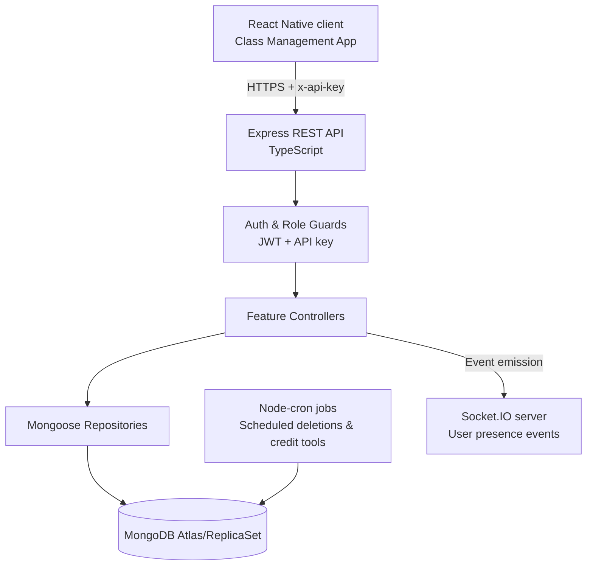

# Class Management API (Node.js)

A production-ready REST API that powers the [Class Management App](https://github.com/AcureroAdrian/class-management-app), enabling the Miyagi Ken International Academy to orchestrate class schedules, attendance, recovery credits, and operational reporting across its United States branches. Built with TypeScript, Express, and MongoDB, the service secures administrator, teacher, and student workflows through JWT authentication, API key gating, and granular role controls.

## Table of contents
- [Product overview](#product-overview)
- [User-facing capabilities](#user-facing-capabilities)
- [Technical architecture](#technical-architecture)
- [Domain modules](#domain-modules)
- [Data model highlights](#data-model-highlights)
- [Project structure](#project-structure)
- [Development workflow](#development-workflow)
- [Environment variables](#environment-variables)
- [Tooling & quality](#tooling--quality)
- [Background jobs & scripts](#background-jobs--scripts)
- [Security & observability](#security--observability)
- [Future opportunities](#future-opportunities)

## Product overview
The API digitises day-to-day academy operations by centralising class metadata, user enrolments, attendance lifecycles, and reporting datasets. When paired with the React Native client, it delivers:

- **Single source of truth for schedules:** maintain karate classes with age/level constraints, capacity rules, instructors, and calendar cadence.
- **Attendance automation:** teachers capture roll-call status in real time while the API enforces duplication rules and aggregates history for analytics.
- **Recovery credit management:** track, issue, and consume recovery classes for missed sessions with safeguards against over-allocation.
- **Administrative control:** onboard students (including trials), manage holidays, schedule deletions, and adjust credit balances without database access.
- **Operational insights:** expose per-class, per-student, and per-day attendance views used by the mobile dashboards for trend analysis.

## User-facing capabilities
The service is organised around three personas surfaced in the mobile app:

### Administrators
- CRUD operations for student records, including trial enrolments and profile updates.
- Bulk import/export utilities to manage credits and class rosters via Excel integrations.
- Scheduled deletion flows to stage user removals with automated cron execution.
- Recovery credit adjustments, overflow handling, and manual overrides for exceptional cases.

### Teachers
- Attendance session creation with duplicate detection to avoid conflicting registers.
- Ability to mark overflow absences, capture notes, and convert attendances into recovery classes.
- Real-time notifications via Socket.IO to reflect teacher presence in collaborative scenarios.

### Students
- Secure login via user ID, delivering JWT tokens consumed by the mobile client.
- Retrieval of personal credits, recovery bookings, and attendance history powering in-app dashboards.

## Technical architecture
The backend emphasises a modular, layered design with strict typing and reusable infrastructure.



Key architectural choices:
- **Express + TypeScript:** structured request/response types, async error handling, and role-based middleware (`src/middleware`).
- **Mongoose ODM:** domain models for users, classes, attendance, recovery classes, and holidays encapsulated in repositories (`src/repositories`).
- **Socket.IO integration:** optional real-time layer that tracks authenticated user connections.
- **Node-cron automation:** recurring jobs enforce scheduled deletions and support synthetic credit workflows.
- **Winston logging:** structured logs emitted to rotating files plus console output for production troubleshooting.

## Domain modules
| Module | Routes | Highlights |
| --- | --- | --- |
| **Authentication** | `POST /api/auth/login` | Validates academy-issued user IDs, generates JWT tokens, and records audit logs. |
| **Users** | `/api/users` | Admin-only endpoints for student onboarding, trial enrolments, profile updates, deletion scheduling/cancellation, and recovery credit adjustments. |
| **Karate classes** | `/api/karate-classes` | Create, update, and delete classes with capacity checks, schedule collisions detection, and level/age helpers. Includes student-specific class queries and admin attendance views. |
| **Student attendance** | `/api/student-attendances` | Create session roll calls, list attendance by date range or class, and integrate recovery class lookups while preventing duplicate records. |
| **Recovery classes** | `/api/recovery-classes` | Manage recovery bookings, reconcile credit balances, and support cancellation flows tied to attendance records. |
| **Holidays** | `/api/holidays` | Maintain academy closures to automatically block scheduling in the mobile app. |
| **System** | `/api/system` | Health check (`/keep-alive`) and operational utilities consumed by infrastructure monitoring. |

All feature routes sit behind the API key middleware (`x-api-key`) and JWT-based `protect` guard. Role-specific handlers (`forUserAdmin`, `forUserTeacher`) ensure only authorised personas reach each controller.

## Data model highlights
| Collection | Purpose | Notable fields |
| --- | --- | --- |
| `User` | Student, teacher, and admin identities with role flags and recovery credit balances. | `userId`, `enrollmentPlan`, `level`, `isAdmin`, `scheduledDeletionDate`, `recoveryCreditsAdjustment`. |
| `KarateClass` | Canonical schedule definitions including age/level ranges and capacities. | `minAge/maxAge`, `levels`, `weekDays`, `startTime`, `location`, `recoveryClasses`. |
| `StudentAttendance` | Session-level attendance with embedded student status records. | `attendance.attendanceStatus`, `isRecovery`, `isOverflowAbsence`, `overflowReason`. |
| `RecoveryClass` | Recovery bookings tied to students and classes, tracking credit consumption. | `student`, `karateClass`, `date`, `status`, `notes`. |
| `Holiday` | Academy-wide closures surfaced in scheduling UI. | `name`, `date`, `type`, `status`. |

Utility helpers (`src/utils`) provide consistent enumerations for levels, weekdays, credit calculations, and Houston-centric date conversions ensuring consistent reporting across services.

## Project structure
```
src/
├─ config/                # Database, server, and Socket.IO bootstrapping
├─ controllers/           # Route handlers grouped by domain (auth, users, classes, etc.)
├─ errors/                # Custom HTTP error classes surfaced by middleware
├─ middleware/            # Auth guards, API key enforcement, role validation, error handling
├─ models/                # Mongoose schemas & TypeScript interfaces for persistence
├─ repositories/          # Data-access abstractions encapsulating query logic
├─ routes/                # Express routers wiring endpoints to controllers
├─ tasks/                 # One-off/recurring scripts for credit and roster maintenance
├─ utils/                 # Cross-cutting helpers (tokens, dates, credits, validators)
├─ __tests__/             # Jest unit tests for controllers and domain services
└─ public/                # Static assets served under `/public`
```

## Development workflow
1. **Install dependencies**
   ```bash
   npm install
   ```
2. **Run the API in development mode** (nodemon-style reloads via `ts-node-dev`):
   ```bash
   npm run dev
   ```
3. **Execute the test suite** (Jest with ts-jest):
   ```bash
   npm test
   ```
4. **Lint and auto-fix issues** (Airbnb + Prettier integration):
   ```bash
   npm run lint
   npm run fix-lint
   ```
5. **Build for production** (emits compiled JavaScript to `dist/`):
   ```bash
   npm run build
   npm start
   ```

> **Local MongoDB**: Provide a `MONGO_URI` pointing to your MongoDB cluster/instance. Development typically uses a MongoDB Atlas sandbox or local Docker container.

## Environment variables
| Variable | Description |
| --- | --- |
| `PORT` | HTTP port for the Express server (defaults to `8000`). |
| `MONGO_URI` | Connection string for MongoDB. |
| `API_KEY` | Shared secret expected in the `x-api-key` header by all `/api` routes (except the health check). |
| `JWT_SECRET` | Secret used to sign and verify JWT tokens. |
| `NODE_ENV` | Controls logging verbosity and error stack exposure (`development`, `production`). |
| `EXCEL_INPUT_FILE` / `EXCEL_OUTPUT_FILE` | Optional overrides for data maintenance scripts operating on spreadsheets. |

Store secrets in a `.env` file (ignored from version control) or inject them via your deployment platform.

## Tooling & quality
- **TypeScript everywhere:** strict typings across controllers, repositories, and models reduce runtime regressions.
- **Testing:** Jest tests cover attendance, booking, and credit services with Mockingoose to simulate MongoDB responses.
- **Logging:** Winston transports emit JSON and human-readable logs partitioned by timestamp for easier production support.
- **Code style:** ESLint (Airbnb base) and Prettier enforce consistent formatting; Husky can be added to run checks pre-commit if desired.
- **Continuous integration ready:** the project’s scripts (`lint`, `test`, `build`) align with typical CI pipelines for rapid adoption.

## Background jobs & scripts
Operational scripts live in `src/tasks/` and are exposed via `npm` commands:

| Command | Purpose |
| --- | --- |
| `npm run synthetic-absent` | Generate synthetic absences for testing teacher workflows. |
| `npm run seed-synthetic-absences` | Seed demo absences into MongoDB. |
| `npm run set-plans-advanced` | Upgrade all students to the advanced enrolment plan. |
| `npm run reset-credits-adjustments` | Reconcile recovery credit adjustments back to baseline values. |
| `npm run export-class-report` | Produce Excel exports for class-level reporting. |
| `npm run adjust-synthetic-credits` / `clear-synthetic-overflow` | Maintain synthetic recovery credit data for sandbox environments. |
| `npm run enrich-excel-with-ids` / `apply-synthetic-credits` / `verify-synthetic-credits` | Power Excel-based import/export flows used by administrators. |

In addition, the Express server bootstraps `startScheduledDeletionCron()` to automatically purge users whose deletions were staged via the admin tools.

## Security & observability
- **API perimeter:** every `/api` route (aside from the health check) requires a valid `x-api-key` plus a JWT bearer token issued at login.
- **Role-based access:** middleware ensures only admins can access student management routes, while teachers/students receive scoped data.
- **Error handling:** centralised middleware returns JSON error payloads with stack traces suppressed in production.
- **Real-time monitoring:** Socket.IO maintains a registry of connected users, enabling live status indicators in the mobile app.
- **Audit trails:** structured Winston logs capture authentication events and domain actions for compliance and debugging.

## Future opportunities
- Expand automated test coverage to include recovery class edge cases and cron job outcomes.
- Introduce OpenAPI/Swagger documentation to ease third-party integrations and QA automation.
- Enhance observability with metrics (Prometheus) and distributed tracing once the API scales beyond a single service.
- Package Docker and Terraform templates to streamline deployments across staging and production environments.

---

> This README is designed to showcase both the product impact and the engineering depth of the Class Management API for prospective collaborators, recruiters, and technical stakeholders.
